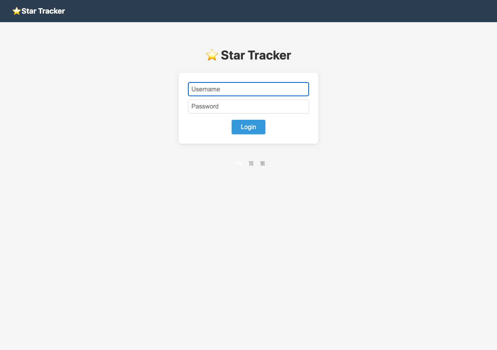
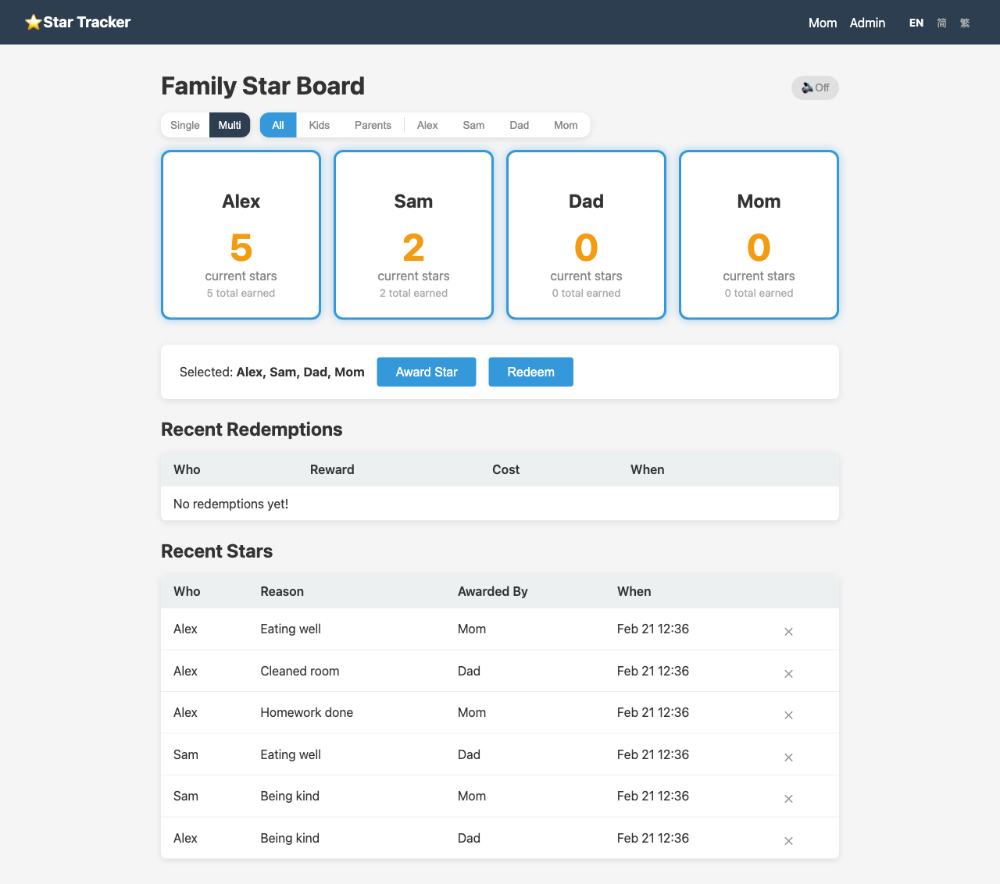
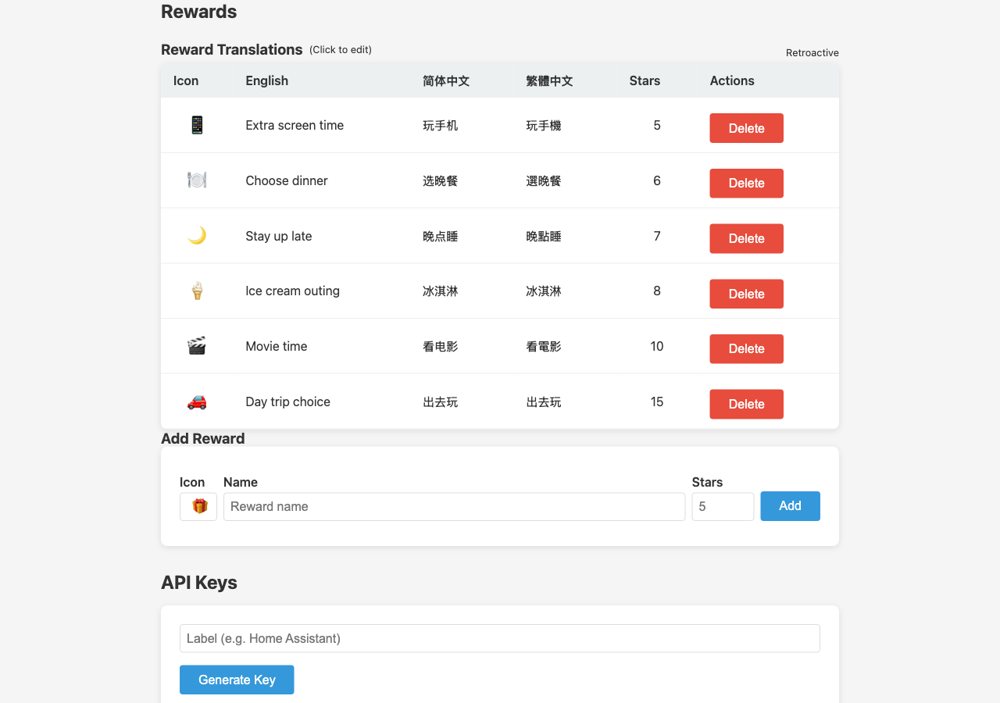
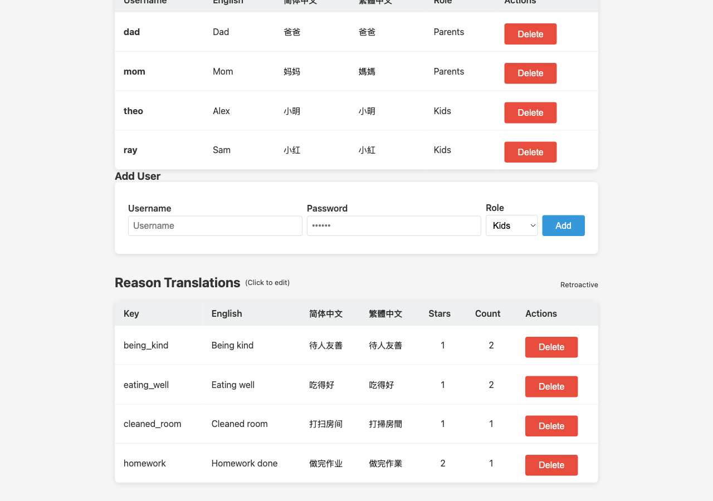

# Star Tracker

A family star reward tracking app. Parents award stars to kids for good behavior, and kids redeem stars for rewards. Built with Go, SQLite, and server-rendered HTML templates.

## Screenshots

| Login | Dashboard |
|-------|-----------|
|  |  |

| Reward Translations | User & Reason Translations |
|---------------------|---------------------------|
|  |  |

## Features

- Star awarding with configurable reasons and star counts (positive or negative)
- Reward redemption system with cost tracking
- Multi-language support (English, Simplified Chinese, Traditional Chinese)
- User management with parent/kid roles
- Home Assistant TTS integration for announcements
- REST API for external integrations (e.g. Home Assistant automations)
- Data import/export as JSON
- Single binary deployment with embedded templates and static assets

## Build & Run

```bash
go build -o star-app .
./star-app -port 8080 -db stars.db
```

### Flags

| Flag    | Default    | Description         |
|---------|------------|---------------------|
| `-port` | `8080`     | HTTP listen port    |
| `-db`   | `stars.db` | SQLite database path|

### Cross-compile for ARM64 Linux

```bash
GOOS=linux GOARCH=arm64 go build -o star-app-arm64 .
```

## Default Accounts

On first run with an empty database, four accounts are seeded:

| Username | Password   | Role   |
|----------|------------|--------|
| `dad`    | `changeme` | Parent |
| `mom`    | `changeme` | Parent |
| `theo`   | `changeme` | Kid    |
| `ray`    | `changeme` | Kid    |

Accounts can be added and removed from the admin panel.

## Architecture

Single-package Go application:

| File            | Purpose                                            |
|-----------------|----------------------------------------------------|
| `main.go`       | Entry point, route registration, template loading  |
| `models.go`     | Data structs (User, Star, Reason, Reward, etc.)    |
| `db.go`         | SQLite schema, migrations, all database queries    |
| `handlers.go`   | HTTP handlers for web UI and REST API              |
| `middleware.go`  | Authentication middlewares (session, admin, API key)|
| `announce.go`   | Home Assistant TTS announcement integration        |

**Templates** are in `templates/` and **static assets** in `static/`, both embedded into the binary via Go's `embed` package.

## Authentication

Three authentication methods:

| Method         | Mechanism                              | Used by          |
|----------------|----------------------------------------|------------------|
| Session cookie | `session` cookie with random hex token | Web UI routes    |
| Admin check    | Session cookie + `is_admin` flag       | Admin routes     |
| API key        | `X-API-Key` header, SHA256 hashed      | `/api/*` routes  |

API keys are generated from the admin panel. The raw key is shown once at creation; only the SHA256 hash is stored.

---

## REST API

All API endpoints require authentication via the `X-API-Key` header.

### GET /api/users

Returns all users with their star counts.

**Response:**

```json
[
  {
    "Username": "theo",
    "DisplayNameEN": "Theo",
    "DisplayNameCN": "西奥",
    "DisplayNameTW": "西奧",
    "StarCount": 42,
    "CurrentStars": 15,
    "IsAdmin": false
  }
]
```

| Field           | Type    | Description                                  |
|-----------------|---------|----------------------------------------------|
| `Username`      | string  | Login username                               |
| `DisplayNameEN` | string  | English display name (from translations)     |
| `DisplayNameCN` | string  | Simplified Chinese display name              |
| `DisplayNameTW` | string  | Traditional Chinese display name             |
| `StarCount`     | int     | Total stars ever earned                      |
| `CurrentStars`  | int     | Current balance (earned minus redeemed)      |
| `IsAdmin`       | bool    | Whether the user is a parent (admin)         |

---

### GET /api/stars

Returns star award history with fully resolved translations for reasons, usernames, and awarder names.

**Query Parameters:**

| Param  | Required | Description                          |
|--------|----------|--------------------------------------|
| `user` | No       | Filter by username                   |

**Response:**

```json
[
  {
    "id": 1,
    "user_id": 3,
    "username": "theo",
    "username_en": "Theo",
    "username_cn": "西奥",
    "username_tw": "西奧",
    "reason_id": 2,
    "reason_text": "",
    "reason_en": "Cleaned room",
    "reason_cn": "打扫房间",
    "reason_tw": "打掃房間",
    "stars": 1,
    "awarded_by": 1,
    "awarded_by_name": "dad",
    "awarded_by_name_en": "Dad",
    "awarded_by_name_cn": "爸爸",
    "awarded_by_name_tw": "爸爸",
    "created_at": "2025-01-15T10:30:00Z"
  }
]
```

| Field                    | Type      | Description                                    |
|--------------------------|-----------|------------------------------------------------|
| `id`                     | int       | Star record ID                                 |
| `user_id`                | int       | Recipient user ID                              |
| `username`               | string    | Recipient username                             |
| `username_en/cn/tw`      | string    | Translated display names                       |
| `reason_id`              | int\|null | Reference to a predefined reason (nullable)    |
| `reason_text`            | string    | Free-text reason (used when no reason_id)      |
| `reason_en/cn/tw`        | string    | Resolved reason translations                   |
| `stars`                  | int       | Number of stars (negative for penalties)        |
| `awarded_by`             | int       | User ID of the person who awarded the star     |
| `awarded_by_name`        | string    | Username of awarder                            |
| `awarded_by_name_en/cn/tw` | string  | Translated awarder names                       |
| `created_at`             | datetime  | When the star was awarded (RFC3339)            |

---

### POST /api/stars

Award stars to a user. Supports both predefined reasons (by ID) and custom text reasons — consistent with the web UI.

**Request Body (JSON):**

```json
{
  "username": "theo",
  "reason_id": 2,
  "reason": "Cleaned room",
  "stars": 2
}
```

| Field       | Type    | Required | Description                                              |
|-------------|---------|----------|----------------------------------------------------------|
| `username`  | string  | Yes      | Recipient username                                       |
| `reason_id` | int     | No       | ID of a predefined reason (uses its translations & default star count) |
| `reason`    | string  | No*      | Custom reason text (*required if no `reason_id`)         |
| `stars`     | int     | No       | Number of stars (default: reason's configured count, or 1; negative for penalties) |

When `reason_id` is provided:
- The reason's configured star count is used unless `stars` is explicitly set
- Translations are linked automatically
- HA announcements use the translated reason text

**Response:**

```json
{
  "status": "ok",
  "counts": [{"Username": "theo", "CurrentStars": 17, ...}],
  "starId": 42
}
```

**Errors:**

| Status | Body                                              | Cause                       |
|--------|---------------------------------------------------|-----------------------------|
| 400    | `{"error":"invalid JSON"}`                        | Malformed request body      |
| 400    | `{"error":"username and reason (or reason_id) required"}` | Missing required fields |
| 400    | `{"error":"user not found: xyz"}`                 | Unknown username            |

---

### GET /api/reasons

Returns all predefined star reasons with translations and usage counts.

**Response:**

```json
[
  {
    "ID": 1,
    "Key": "cleaned_room",
    "Translations": {
      "en": "Cleaned room",
      "zh-CN": "打扫房间",
      "zh-TW": "打掃房間"
    },
    "Count": 15,
    "Stars": 1
  }
]
```

| Field          | Type              | Description                              |
|----------------|-------------------|------------------------------------------|
| `ID`           | int               | Reason ID                                |
| `Key`          | string            | Unique key identifier                    |
| `Translations` | map[string]string | Language code to translated text          |
| `Count`        | int               | Number of times this reason has been used |
| `Stars`        | int               | Default star count for this reason        |

---

### GET /api/rewards

Returns all configured rewards with translations.

**Response:**

```json
[
  {
    "ID": 1,
    "Name": "Ice cream outing",
    "Cost": 8,
    "Icon": "🍦",
    "Translations": {
      "en": "Ice cream outing",
      "zh-CN": "冰淇淋外出",
      "zh-TW": "冰淇淋外出"
    }
  }
]
```

| Field          | Type              | Description                     |
|----------------|-------------------|---------------------------------|
| `ID`           | int               | Reward ID                       |
| `Name`         | string            | English name (backward compat)  |
| `Cost`         | int               | Star cost to redeem             |
| `Icon`         | string            | Emoji icon                      |
| `Translations` | map[string]string | Language code to translated name |

---

### GET /api/redemptions

Returns redemption history.

**Query Parameters:**

| Param  | Required | Description                          |
|--------|----------|--------------------------------------|
| `user` | No       | Filter by username                   |

**Response:**

```json
[
  {
    "ID": 1,
    "UserID": 3,
    "Username": "theo",
    "UsernameEN": "Theo",
    "UsernameCN": "西奥",
    "UsernameTW": "西奧",
    "RewardName": "Ice cream outing",
    "RewardNameEN": "Ice cream outing",
    "RewardNameCN": "冰淇淋外出",
    "RewardNameTW": "冰淇淋外出",
    "Cost": 8,
    "CreatedAt": "2025-01-15T14:00:00Z"
  }
]
```

| Field                | Type     | Description                              |
|----------------------|----------|------------------------------------------|
| `ID`                 | int      | Redemption record ID                     |
| `UserID`             | int      | User who redeemed                        |
| `Username`           | string   | Username                                 |
| `UsernameEN/CN/TW`   | string   | Translated display names                 |
| `RewardName`         | string   | English reward name (backward compat)    |
| `RewardNameEN/CN/TW` | string   | Translated reward names                  |
| `Cost`               | int      | Stars spent (snapshot at redemption time) |
| `CreatedAt`          | datetime | When the redemption occurred (RFC3339)   |

---

## Admin Web API

These endpoints require session authentication with admin privileges. They are used by the admin panel's JavaScript and can also be called programmatically.

### POST /star

Award a star from the web UI. Supports both form submission and JSON response.

**Form Data:**

| Field       | Required | Description                                  |
|-------------|----------|----------------------------------------------|
| `username`  | Yes      | Recipient username                           |
| `reason_id` | No       | ID of a predefined reason                    |
| `reason`    | Yes*     | Reason text (*required if no `reason_id`)    |
| `stars`     | No       | Number of stars (default based on reason)    |

Set `Accept: application/json` header to receive JSON instead of a redirect:

```json
{
  "counts": [{"Username": "theo", "CurrentStars": 16, ...}],
  "awardedBy": "dad",
  "starId": 42
}
```

---

### POST /redeem

Redeem a reward. Set `Accept: application/json` for JSON response.

**Form Data:**

| Field       | Required | Description          |
|-------------|----------|----------------------|
| `reward_id` | Yes      | Reward ID to redeem  |
| `username`  | Yes      | Username redeeming   |

**JSON Response:**

```json
{
  "counts": [{"Username": "theo", "CurrentStars": 6, ...}],
  "rewardName": "Ice cream outing",
  "cost": 8
}
```

**Errors:** Returns plain text — "user not found", "reward not found", or "{name} doesn't have enough stars (has X, needs Y)".

---

### DELETE /star/{id}

Remove a star record. Cannot delete your own stars.

**Response:** JSON array of updated user star counts.

---

### DELETE /redemption/{id}

Remove a redemption record. Cannot delete your own redemptions.

**Response:** JSON array of updated user star counts.

---

### PUT /admin/reason/{id}

Update a reason's translation or star count.

**Form Data:**

| Field         | Required | Description                                     |
|---------------|----------|-------------------------------------------------|
| `lang`        | No       | Language code (`en`, `zh-CN`, `zh-TW`)          |
| `text`        | No       | Translation text (required with `lang`)         |
| `stars`       | No       | New default star count                          |
| `retroactive` | No       | `1` to update existing star records (default), `0` to only change future awards |

**Response:** `{"status": "ok"}`

---

### DELETE /admin/reason/{id}

Delete a reason and all its translations.

**Response:** `{"status": "ok"}`

---

### PUT /admin/reward/{id}

Update a reward's translation or cost.

**Form Data:**

| Field         | Required | Description                                     |
|---------------|----------|-------------------------------------------------|
| `lang`        | No       | Language code                                   |
| `text`        | No       | Translation text                                |
| `cost`        | No       | New star cost                                   |
| `retroactive` | No       | `1` to update past redemption costs (default), `0` to snapshot current cost in existing redemptions |

**Response:** `{"status": "ok"}`

---

### DELETE /admin/reward/{id}

Delete a reward.

**Response:** HTTP 200

---

### PUT /admin/user/{id}

Update a user's display name translation.

**Form Data:**

| Field  | Required | Description          |
|--------|----------|----------------------|
| `lang` | Yes      | Language code        |
| `text` | Yes      | Translated name      |

**Response:** `{"status": "ok"}`

---

### DELETE /admin/user/{id}

Delete a user and all associated data (stars, redemptions, sessions, translations). Cannot delete your own account.

**Response:** HTTP 200

---

### POST /admin/toggle-announce

Toggle Home Assistant announcements on/off.

**Response:**

```json
{"ha_enabled": "1"}
```

---

### GET /admin/export

Download all application data as JSON.

**Response:** `application/json` file attachment (`star-app-export.json`).

Exported data includes: users (without password hashes), stars, reasons, rewards, redemptions, and settings.

---

### POST /admin/import

Import previously exported JSON data. Replaces all existing stars, reasons, rewards, and redemptions.

**Form Data:** Multipart file upload with field name `file` (accepts `.json`).

---

## Home Assistant Integration

Configure from the admin panel under "Home Assistant Announce":

1. Enable announcements
2. Set your Home Assistant URL (e.g., `https://home.example.com`)
3. Set a Long-Lived Access Token (generate from HA user profile)
4. Set the media player entity (e.g., `media_player.living_room`)
5. Choose the announcement language

When a star is awarded, the app calls Home Assistant's TTS service to announce it. Positive and negative stars get different messages:

| Language | Positive                              | Negative                              |
|----------|---------------------------------------|---------------------------------------|
| English  | "{name} got {n} stars for {reason}!"  | "{name} lost {n} stars for {reason}!" |
| 简体中文 | "{name} 因为{reason}获得了 {n} 颗星星！" | "{name} 因为{reason}失去了 {n} 颗星星！" |
| 繁體中文 | "{name} 因為{reason}獲得了 {n} 顆星星！" | "{name} 因為{reason}失去了 {n} 顆星星！" |
